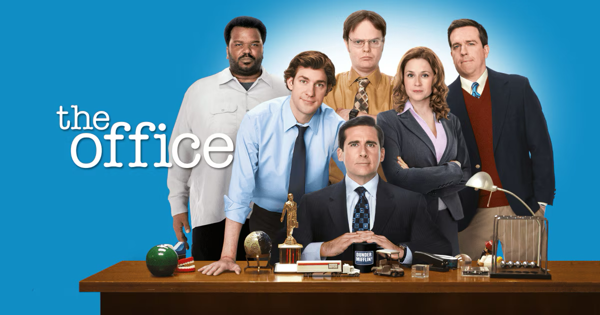

 [Image from peacock website](https://www.peacocktv.com/stream-tv/the-office)

### Introduction

I got this data from [Kaggle](https://www.kaggle.com/datasets/fabriziocominetti/the-office-lines). The [direct link](https://www.officequotes.net/) is not longer active. However, the cited source to the TV show is The Office. Created by Greg Daniels, performances by Steve Carell, Rainn Wilson, and John Krasinski, NBC, 2005–2013.

The goal of this project is to show how many lines have the word "Jesus" or phrase "Jesus Christ" in "The Office." We also set out to see how many times the main characters of the "The Office" said office. We will use bar plots for both questions as effective ways to illustrate our findings. We are able to pull the lines directly from the scripts of "The Office" television series.

### Libraries
The following are the libraries that we use in this exercise.
```{r,}
library(tidyverse)
```

### Import Data
We import the following data from [Kaggle](https://www.kaggle.com/datasets/fabriziocominetti/the-office-lines).
```{r}
office <- read.csv("the-office_lines.csv")
```

### Jesus Text Analysis
We first mutate to add an additional column `line_ci`. We do this to ignore the capitalization in our `str_detect()`. We summarize to derive the number of times both the word and phrase were spoken. We pivot for a usable format in ggplot.
```{r}
j_sum <- office |>
  # Remove capitalization for `str_detect()`
  mutate(line_ci = str_to_lower(Line)) |> 
  summarize(`"Jesus Christ"` = sum(str_count(line_ci, "\\bjesus\\b\\s+\\bchrist\\b")),
         `"Jesus"` = sum(str_count(line_ci, "\\bjesus\\b(?!\\s+christ\\b)"))) |> 
  # Create a usable format for ggplot
  pivot_longer(cols = everything(), names_to = 'category', values_to = 'value')

head(j_sum)

```


```{r, fig.alt="This bar plot describes how many lines have the word 'Jesus' in 'The Office.' The plots shows tht 'Christ' follows 'Jesus' two times and 'Jesus' is said in twenty-four lines."}
ggplot(j_sum, aes(x = category, y = value)) +
  geom_col(fill = "#E5C494") +
  labs(title = "How Many Times Jesus Was Said In The Office", 
       x = "Phrase Said", y = "Number of Times Said") +
  theme_minimal()

```

This graph illustrates how many times the word "Jesus" in "The Office." The insights I gained from my plot is how often "Christ" follows "Jesus." The graph shows the frequency of the collocation. It is suprising how uncommon it occurs.

### Office in "The Office" Analysis
These are the main charcters we are going to focus on in this analysis. 
```{r}
main_chars <- c(
  "Michael", "Dwight", "Jim", "Pam", "Andy", "Ryan", "Stanley",
  "Phyllis", "Angela", "Kevin", "Oscar", "Meredith", "Creed",
  "Toby", "Kelly", "Erin", "Darryl")
```

```{r}
off_sum <- office |>
  # Remove capitalization for `str_detect()`
  mutate(line_ci = str_to_lower(Line)) |> 
  group_by(Character) |> 
  summarize(`Office` = sum(str_detect(line_ci, "\\boffice\\b"))) |> 
  filter(Character %in% main_chars) |> 
  arrange(desc(Office))

head(off_sum)
```


```{r}

off_sum |> 
  ggplot(aes(x = reorder(Character, Office), y = Office, fill = Character)) +
  geom_bar(stat = "identity", width = 1, color = "white", show.legend = FALSE) +
  geom_text(aes(label = paste0(Office)), 
            vjust = 0.5, 
            hjust = -0.2,
            size = 3.5,
            color = "black") +
  scale_fill_manual(values = c(
    "#E41A1C", "#377EB8", "#4DAF4A", "#984EA3",
    "#FF7F00", "#FFFF33", "#A65628", "#F781BF",
    "#999999", "#66C2A5", "#FC8D62", "#8DA0CB",
    "#E78AC3", "#A6D854", "#FFD92F", "#E5C494", "#00FF66"
  )) +
  labs(y = "",
       x = "",
       title = 'Times "Office" Was Said By Main Character From "The Office"') +
  theme_minimal() +
  theme(axis.text.x = element_blank(),
        panel.grid = element_blank(),
        plot.title = element_text(hjust = 0.6)) +
  coord_flip()


```

This graph illustrates how many lines of the main characters of the "The Office" contained the word "office". Besides the pie chart, there is also a table with character names and the frequency of how often they said the word. The insights I gained from my plot is Michael, the main character, is the most frequent user of the word "office", but no character makes up the majority.


